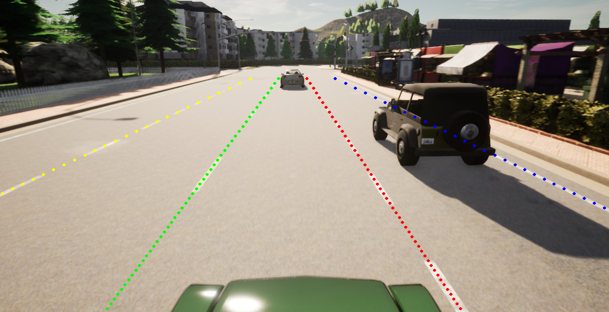

# Carla-Lane-Detection-Dataset-Generation
As part of a project in our university, it was our task to implement an agent in CARLA-Simulator, which autonomously collects image and label data to generate a dataset.
This can be used later to train a Deep Convolutional Neural Network, which is able to detect lanemarkings on a road.

The overall project is split up into two parts:

- The first part covers how to create and generate a dataset. It's what this repository is used for. 
- The second part covers the training and testing of a Deep Convolutional Neural Network, which is able to detect lanemarkings on a road. It's what [this repository](https://github.com/Glutamat42/Ultra-Fast-Lane-Detection) is used for.

## Project overview
This repository consists of 2 parts:
- Collect data in CARLA by executing `fast_lane_detection.py`
- Generate a dataset with the collected data `dataset_generator.py`

## Install
For Installation, please read [carla_setup.md](https://github.com/Glutamat42/Carla-Lane-Detection-Dataset-Generation/blob/master/docs/source/howto/carla_setup.md)

## Get Started

Before doing anything, make sure that your CARLA Server is running. 
After that, do the following steps:

1. Execute and run `fast_lane_detection.py`. 
This collects all the data in CARLA and saves them as .npy (numpy) files and generates temporary label files, which are later filtered. 

2. Execute and run `dataset_generator.py`. 
All the raw images and labels are then converted to .jpg images and .json labels. This file creates a `dataset` directory and places the processed files inside. Another task of this script is to balance the data.

3. Execute and run `image_to_video.py`. 
After generating the dataset, the images can then be converted to a video. This might be helpful, if you want to check your images and labels for errors.

## Further documentation
For any details, please refer to the **full documentation** in the /docs directory.

## Thanks
Thanks to [sagnibak](https://github.com/sagnibak) for his work on figuring out how to efficiently save image data in CARLA with .npy. Without his work, it would have been a lot more time consuming regarding this problem. For more information refer to his self-driving car project on Github: https://github.com/sagnibak/self-driving-car
